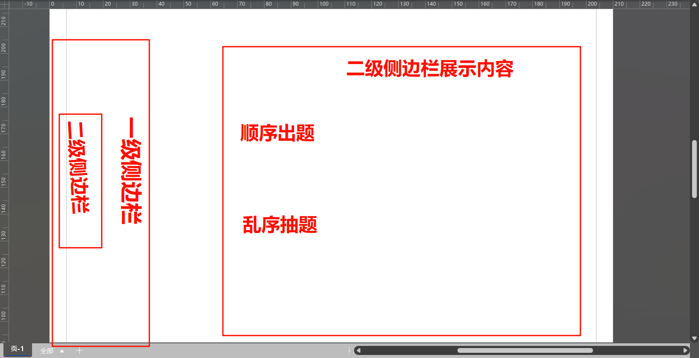

# Vue 3 + Vite

这是一个十分简单的题库管理系统：题库管理系统的前端部分，使用 Vue 3 + Vite 构建,使用了 Element Plus,使用了 Ant Design Vue。

一级侧边框架:有选择题，简答题，题库：选择题，简答题，题库的增删改查功能。
二级侧边框架：选择题，简答题的二个模式，分别是顺序抽题和随机抽题。

src/
├── api/                # API 接口封装
│   ├── request.js      # axios 封装与拦截器
│   ├── question.js     # 题目相关接口
│   └── bank.js         # 题库相关接口
├── assets/             # 静态资源
├── components/         # 公共组件
│   ├── Layout/         # 布局组件
│   └── Question/       # 题目相关组件
├── router/             # 路由配置
├── store/              # 状态管理
├── styles/             # 全局样式
├── utils/              # 工具函数
└── views/              # 页面组件